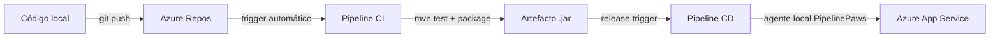

<h1 align="center">🐾 PawsHome</h1>

<p align="center">
  Plataforma web para conectar mascotas de refugios con personas dispuestas a adoptarlas.
</p>

<p align="center">
  
  
  
  
  
  
</p>

---

## Descripción

PawsHome es una aplicación web MVC desarrollada con Spring Boot que facilita la gestión y adopción de mascotas en refugios. Los administradores de refugio publican y gestionan mascotas; los visitantes exploran el catálogo público de mascotas disponibles.

---

## Stack tecnológico

| Capa | Tecnología |
|---|---|
| Lenguaje | Java 21 |
| Framework | Spring Boot 3.3.5 |
| Vistas | Thymeleaf + Spring Security extras |
| Seguridad | Spring Security 6 · BCrypt |
| Persistencia | Spring Data JPA · Hibernate |
| Base de datos | Azure SQL Server |
| Build | Maven |
| Utilidades | Lombok |
| Testing | JUnit 5 · Mockito · MockMvc |

---

## Roles y permisos

| Rol | Capacidades |
|---|---|
| `ADMINISTRADOR_REFUGIO` | Registrar mascotas, gestionar su catálogo, cambiar disponibilidad |
| `USUARIO` | Ver catálogo público de mascotas disponibles |
| `ADMINISTRADOR` | Administración general del sistema |
| Anónimo | Inicio, login y catálogo público |

---

## Endpoints principales

| Método | Ruta | Descripción | Acceso |
|---|---|---|---|
| GET | `/` | Página de inicio | Público |
| GET | `/login` | Formulario de inicio de sesión | Público |
| GET | `/mascotas/disponibles` | Catálogo público de mascotas | Público |
| GET | `/mascotas/nueva` | Formulario de registro de mascota | Admin refugio |
| POST | `/mascotas` | Guardar nueva mascota | Admin refugio |
| GET | `/mascotas/gestion` | Gestión de mascotas del administrador | Admin refugio |
| GET | `/mascotas/{id}/disponibilidad` | Vista de cambio de disponibilidad | Admin refugio |
| POST | `/mascotas/{id}/disponibilidad` | Confirmar cambio de disponibilidad | Admin refugio |

---

## Flujo CI/CD



---

## Estructura del proyecto

```
pawshome/
├── src/main/java/com/example/
│   ├── config/          # Inicialización de datos en perfil dev
│   ├── controller/      # HomeController · MascotaController
│   ├── dto/             # MascotaForm (validaciones Jakarta)
│   ├── exception/       # AccesoDenegadoException · MascotaNoEncontradaException
│   ├── model/           # Usuario · Mascota · EstadoMascota · RolUsuario
│   ├── repository/      # UsuarioRepository · MascotaRepository
│   ├── security/        # SecurityConfig · UsuarioDetailsService
│   └── service/         # MascotaService
└── src/main/resources/
    ├── application.properties           # Activa perfil dev
    ├── application-dev.properties       # Conexión Azure SQL Server
    ├── application-prod.properties
    ├── static/css/                      # Estilos por vista
    └── templates/                       # Vistas Thymeleaf
        ├── index.html
        ├── login.html
        ├── registro-mascota.html
        └── mascotas/
            ├── listado-disponibles.html
            ├── gestion.html
            └── cambiar-disponibilidad.html
```

---

## Ejecución local

**Requisitos:** Java 21 · Maven 3.8+ · acceso a `pawshomesql.database.windows.net`

```bash
cd pawshome
mvn spring-boot:run
```

La aplicación inicia en `http://localhost:8080` usando el perfil `dev` (Azure SQL Server).

---

## Tests

```bash
cd pawshome
mvn test
```

| Suite | Cobertura |
|---|---|
| `MascotaServiceTest` | Lógica de negocio con Mockito |
| `MascotaControllerTest` | Capa web con MockMvc standalone |
| `MascotaFormTest` | Validaciones de Jakarta Bean Validation |

---

## Base de datos

**Servidor:** `pawshomesql.database.windows.net:1433` · **BD:** `petconnect_db` · **DDL:** `hibernate.ddl-auto=update`

| Tabla | Columnas principales |
|---|---|
| `usuarios` | `id`, `nombre`, `correo`, `password_hash`, `rol`, `activo`, `fecha_creacion` |
| `mascotas` | `id`, `nombre`, `especie`, `raza`, `edad_aproximada`, `sexo`, `descripcion`, `estado_disponibilidad`, `imagen_url`, `fecha_publicacion`, `administrador_id` |

---

## Notas de desarrollo

- **Lombok + VSCode:** el IDE puede mostrar falsos positivos para métodos generados (`getId()`, etc.). `mvn test-compile` es la fuente de verdad.
- **Imágenes:** si `imagenUrl` es nulo o vacío, se muestra un placeholder por especie.
- **Sesión:** cookie `JSESSIONID`, invalidada al hacer logout.
